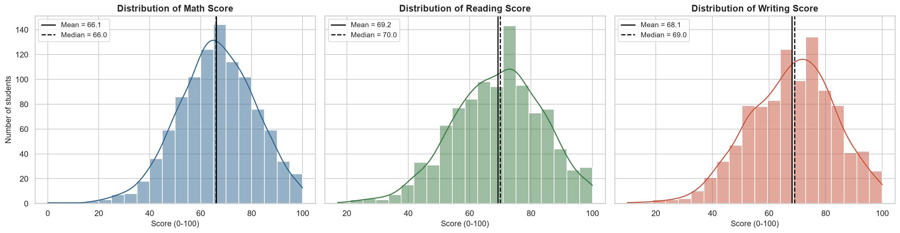
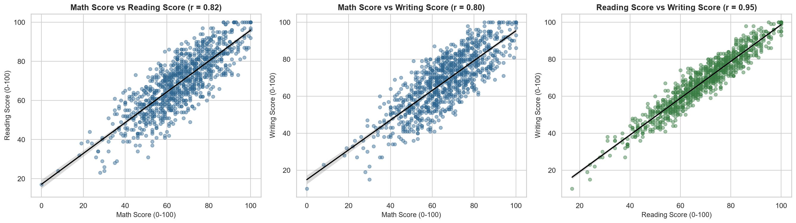
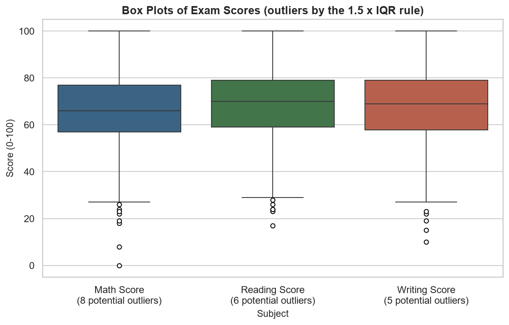
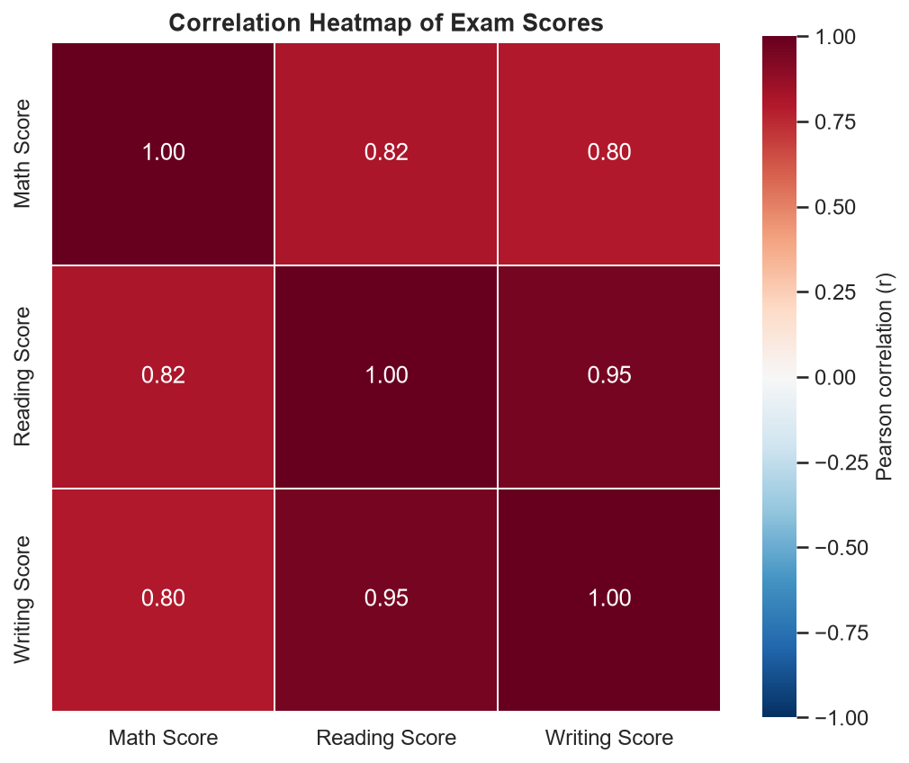
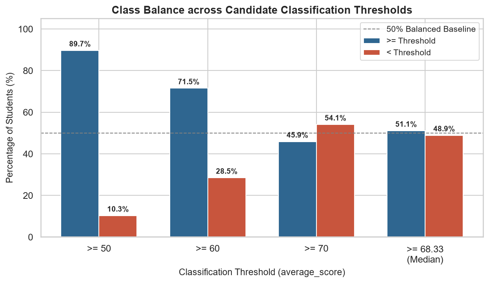

# Student Performance Data Explorer

**AI & ML Internship - Task 1:** Development Environment Setup, Python Foundations & Data Exploration

An Exploratory Data Analysis (EDA) of a student exam-score dataset using Python, pandas and
seaborn. The project loads the data, checks its quality, cleans it, calculates descriptive
statistics, studies correlations, detects outliers, visualizes the results and records the
findings in a notebook and a written report.

> **Scope:** this is a data-exploration task. No machine-learning model is trained.

---

## Project Overview

The dataset ("Students Performance in Exams") describes 1,000 students by five background
variables (gender, race/ethnicity, parental education, lunch type, test-preparation status) and
three exam scores (math, reading, writing). The analysis looks at how the scores are distributed,
how they relate to each other, whether there are unusual values, and how average scores differ
between student groups.

## Objectives

1. Load the dataset with pandas and explore its structure and data types.
2. Analyze missing values and duplicate records.
3. Clean the data (rename columns, standardize text, handle missing values and duplicates).
4. Calculate descriptive statistics: mean, median, mode, standard deviation, minimum, maximum.
5. Perform correlation analysis.
6. Create meaningful visualizations.
7. Detect and visualize potential outliers.
8. Write observations and insights based on the actual results.
9. Produce a final EDA report and a GitHub-ready project.

## Dataset

| Item | Details |
|------|---------|
| Name | Students Performance in Exams |
| Source | [Kaggle](https://www.kaggle.com/datasets/spscientist/students-performance-in-exams); the CSV in this project was **downloaded** from a public GitHub copy of that dataset |
| Size | 1,000 rows x 8 columns |
| License | Listed as "Unknown" on Kaggle |

**Important:** the Kaggle page does not document how the data was collected, so the findings describe
*this dataset only* and should not be generalized to real student populations. Full column
descriptions, provenance and license notes are in [`data/README.md`](data/README.md).

An optional second notebook applies the same workflow to the classic **Iris** dataset
(`data/iris.csv`).

## Technologies Used

- Python
- Pandas
- NumPy
- Matplotlib
- Seaborn
- Jupyter Notebook

## Project Workflow

```
Dataset
  -> Data Loading
  -> Data Cleaning
  -> Exploratory Analysis
  -> Visualization
  -> Insights
```

## Project Structure

```
Take1/
│
├── data/
│   ├── student_data.csv            # raw dataset (unchanged)
│   ├── cleaned_student_data.csv    # cleaned dataset (handoff for Task 2)
│   ├── iris.csv                    # dataset for the optional Iris notebook
│   └── README.md                   # dataset documentation
│
├── notebooks/
│   ├── student_performance_eda.ipynb   # main analysis (with outputs)
│   └── iris_eda.ipynb                  # optional advanced challenge
│
├── src/
│   ├── __init__.py
│   ├── data_cleaning.py            # loading, quality checks, cleaning functions
│   └── data_analysis.py            # statistics, correlation, outliers, plotting functions
│
├── images/                         # charts saved by the notebooks
│   ├── histogram.png
│   ├── scatter_plot.png
│   ├── box_plot.png
│   ├── correlation_heatmap.png
│   ├── correlation_matrix.png
│   ├── threshold_balance.png
│   └── (additional charts: category counts, group comparisons, Iris charts)
│
├── reports/
│   ├── EDA_Report.md
│   └── EDA_Report.pdf
│
├── README.md
├── requirements.txt
├── .gitignore
└── LICENSE
```

## Analysis Performed

- **Dataset exploration** - shape, columns, data types, numerical vs categorical columns.
- **Missing-value analysis** - count and percentage per column.
- **Duplicate removal** - duplicate check and removal function.
- **Cleaning** - snake_case column names, standardized text, missing-value handling (demonstrated on a
  small made-up example, because the real data has none).
- **Descriptive statistics** - mean, median, mode, standard deviation, min, max, quartiles, skewness.
- **Univariate and bivariate analysis** - histograms, count plots, scatter plots.
- **Correlation analysis** - correlation matrix and heatmap.
- **Outlier analysis** - box plots and the 1.5 x IQR rule.
- **Group comparison** - scores by gender, race/ethnicity, parental education, lunch type and
  test preparation.
- **Insights** - written observations tied to the actual results.

## Visualizations

| Score distributions | Relationships between scores |
|---|---|
|  |  |

| Outliers (box plots) | Correlation heatmap |
|---|---|
|  |  |

| Candidate threshold balance (Task 2 prep) |
|---|
|  |

Also generated: [`correlation_matrix.png`](images/correlation_matrix.png),
[`categorical_counts.png`](images/categorical_counts.png),
[`score_by_category_boxplots.png`](images/score_by_category_boxplots.png),
[`mean_scores_by_gender.png`](images/mean_scores_by_gender.png),
[`mean_scores_by_parental_education.png`](images/mean_scores_by_parental_education.png) and
[`threshold_balance.png`](images/threshold_balance.png).

## Key Findings

These come from the executed notebook (see the notebook and `reports/EDA_Report.md` for details):

- **Data quality:** all 1,000 records are complete - no missing values, no duplicate rows and no
  scores outside 0-100. Cleaning therefore changed column names and text format, not the number of rows.
- **Scores:** mean scores are 66.09 (math), 69.17 (reading) and 68.05 (writing); the distributions are
  roughly bell-shaped with a slightly longer tail of low scores.
- **Correlations:** reading and writing scores are almost perfectly aligned (r = 0.955); math correlates
  strongly with reading (0.818) and writing (0.803). All correlations are positive.
- **Outliers:** 12 students have unusually low scores in at least one subject; there are no high
  outliers. They look like genuine low scores (no value is outside 0-100) and were kept.
- **Test preparation:** students who completed the course average about 7.6 points higher (72.67 vs 65.04).
- **Lunch type:** students with a standard lunch average about 8.6 points higher (70.84 vs 62.20).
- **Gender:** male students score higher in math; female students score higher in reading and writing.
- **Parental education:** average scores generally rise with the parent's education level, but not
  perfectly (63.10 for *high school* up to 73.60 for *master's degree*).

All differences are **associations within this dataset**, not proof of cause and effect.

## How to Run

1. Install the packages listed in `requirements.txt`:

   ```
   pip install -r requirements.txt
   ```

2. Open the notebook, either with Jupyter or in VS Code:

   ```
   jupyter notebook notebooks/student_performance_eda.ipynb
   ```

3. Run all cells from top to bottom. The notebook reads `data/student_data.csv`, writes
   `data/cleaned_student_data.csv` and saves its charts to `images/`.

The notebook expects to be started from the `notebooks/` folder (this is the default in Jupyter and
VS Code); it also works if started from the project root. The optional Iris analysis is in
`notebooks/iris_eda.ipynb`.

The helper scripts can also be run directly from the project root:

```
python src/data_cleaning.py     # regenerates data/cleaned_student_data.csv
python src/data_analysis.py     # regenerates the core charts in images/
```

`reports/EDA_Report.pdf` was created from `reports/EDA_Report.md`. If you edit the Markdown report,
re-export it to PDF with any Markdown-to-PDF tool (for example the "Markdown PDF" extension in VS Code).

The code was developed with Python 3.12 (pandas 3.0, NumPy 2.4, Matplotlib 3.10, Seaborn 0.13) and
also tested with pandas 2.2, NumPy 1.26 and Matplotlib 3.8.

## Future Scope (Handoff to Task 2)

The cleaned dataset (`data/cleaned_student_data.csv`) is prepared for handoff to **Task 2** (supervised machine learning). Key considerations identified during exploratory analysis include:

- **Target Choice:** Because the dataset does not have a single designated "final score" column, Task 2 will select an appropriate prediction target: continuous regression on `math_score`, continuous regression on `average_score`, or binary classification using a threshold with viable class balance (e.g., $\ge 70$ or $\ge \text{median}$ of 68.33, avoiding badly imbalanced cutoffs like $\ge 50$).
- **Data Leakage Prevention:** Because `average_score` is directly computed from `math_score`, `reading_score`, and `writing_score`, none of those score columns (nor any features derived from them) may be included as predictors. Models must predict performance strictly using background features known prior to exam administration.
- **Preprocessing and ML Modeling:** Encoding categorical background features (one-hot encoding for nominal categories, ordinal encoding for parental education levels), train/test splitting, baseline modeling, supervised machine-learning algorithms, and model evaluation.

These modeling steps are **not** part of Task 1 and are not implemented here; Task 1 remains strictly an exploratory analysis project.

## License

The code and written analysis are released under the MIT License (see [`LICENSE`](LICENSE)). The datasets
keep their own terms - see [`data/README.md`](data/README.md).
