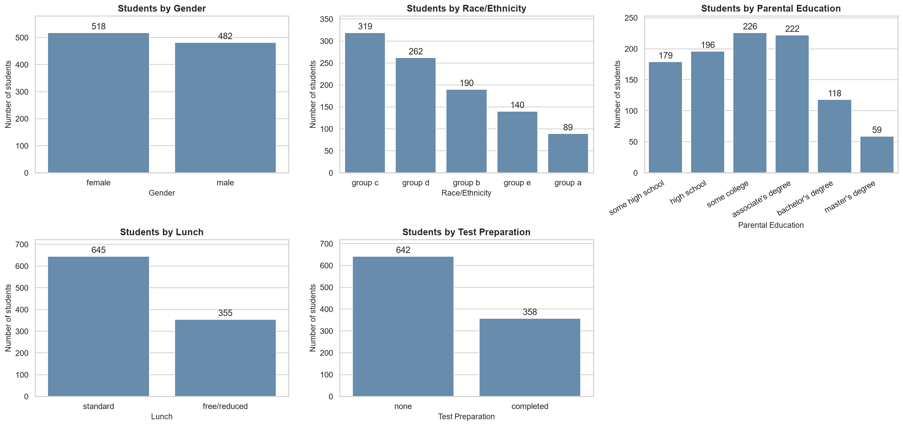
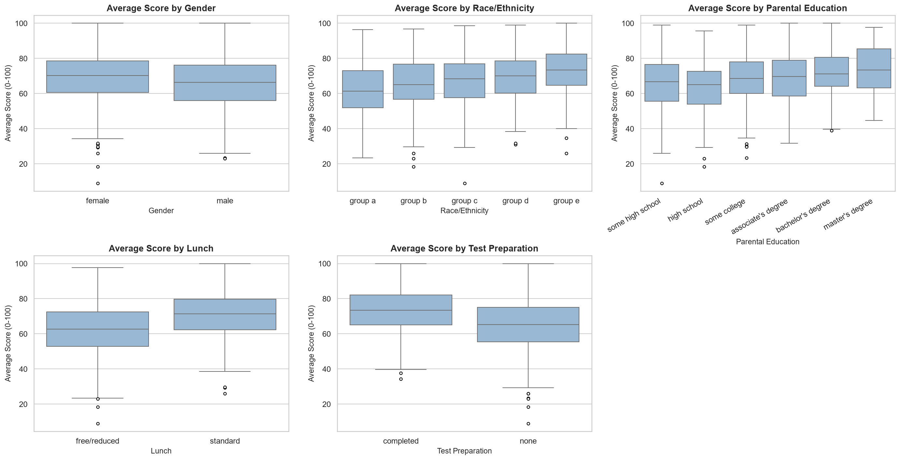
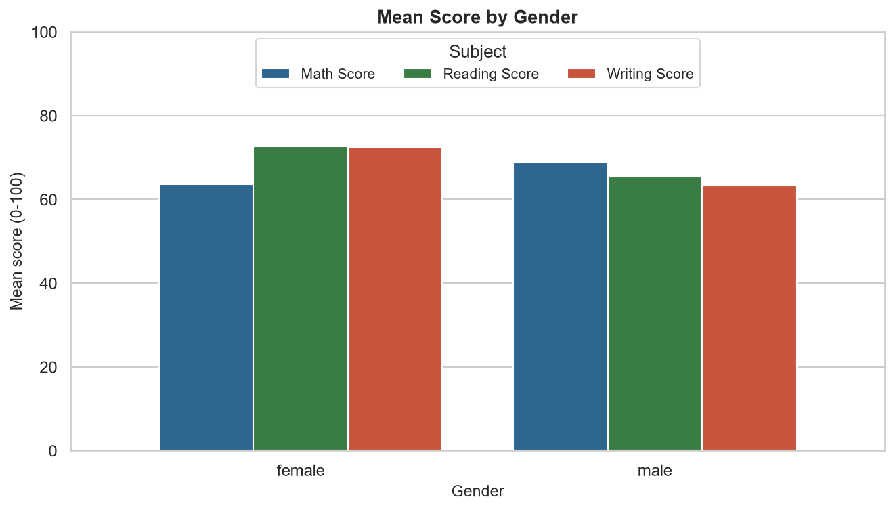
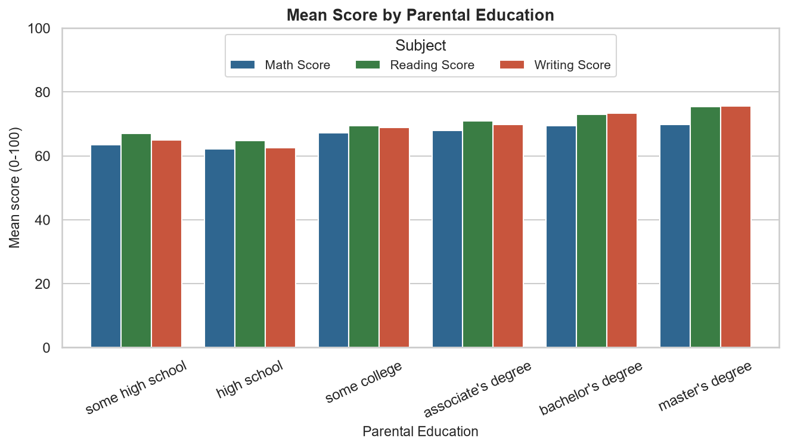

# Student Performance Data Explorer: Exploratory Data Analysis Report

**AI & ML Internship - Task 1:** Development Environment Setup, Python Foundations & Data Exploration

---

## 1. Introduction

Exam scores are a common indicator of how students are doing, and understanding how they are distributed
and which groups differ is a typical first step before any deeper educational or predictive work. This
report documents an exploratory data analysis (EDA) of a student exam-score dataset with 1,000 students. It
summarizes what was done in the accompanying notebook (`notebooks/student_performance_eda.ipynb`) and
the results that it produced. All numbers in this report were computed from the dataset.

## 2. Project Objective

To load, inspect, clean, describe and visualize the Student Performance dataset using Python (pandas,
NumPy, Matplotlib, Seaborn), and to record what the data actually shows. The analysis tries to answer:

1. Is the dataset complete and consistent enough to analyze?
2. How are the math, reading and writing scores distributed?
3. How strongly are the three scores related?
4. Are there unusual scores, and do they look like real performance or data errors?
5. How do average scores differ by gender, race/ethnicity, parental education, lunch type and
   test-preparation status?

No machine-learning model is built in this task; that is left for Task 2.

## 3. Dataset Description

* **Name:** Students Performance in Exams (file `data/student_data.csv`).
* **Source:** Kaggle (<https://www.kaggle.com/datasets/spscientist/students-performance-in-exams>). The file
  used here was downloaded from a public GitHub copy of that dataset, not generated by this project.
* **Size:** 1,000 rows and 8 columns (5 categorical, 3 numerical).
* **License:** listed as "Unknown" on Kaggle.
* **Limitation:** the Kaggle page does not document how the data was collected. Findings therefore
  describe this dataset only and should not be generalized to real student populations.

| Column (raw name) | Cleaned name | Type | Values / range |
|---|---|---|---|
| gender | gender | categorical | female, male |
| race/ethnicity | race_ethnicity | categorical | group A - group E |
| parental level of education | parental_education | categorical | 6 education levels (some high school ... master's degree) |
| lunch | lunch | categorical | standard, free/reduced |
| test preparation course | test_preparation | categorical | none, completed |
| math score | math_score | numerical | 0 - 100 |
| reading score | reading_score | numerical | 17 - 100 |
| writing score | writing_score | numerical | 10 - 100 |

The score columns are integers on a 0-100 scale. `none` in the test-preparation column means the course
was not completed; it is a real category, not a missing value.

## 4. Data Quality Analysis

| Check | Result |
|---|---|
| Missing values | **0** in all 8 columns |
| Fully duplicated rows | **0** |
| Scores outside 0-100 | **0** |
| Text values with leading/trailing spaces | **0** |
| Number of categories | gender 2, race/ethnicity 5, parental education 6, lunch 2, test preparation 2 |

The only inconsistency found is cosmetic: `race/ethnicity` values are written with a capital letter
(`group A` ... `group E`) while every other text column is lowercase. Because every score is within
0-100, an extreme score found later is *unusual*, not *invalid*. Overall the dataset is already very clean.

## 5. Data Cleaning

| Step | What was done | Why | Effect on this dataset |
|---|---|---|---|
| Column names | Converted to lowercase `snake_case`; two shortened (`parental_education`, `test_preparation`) | Names with spaces or `/` are awkward in code | 6 columns renamed |
| Text values | Stripped spaces and lowercased | The same category should always be spelled the same way | 1,000 `race_ethnicity` values changed (`group A` -> `group a`) |
| Missing values | Would be *filled* (median for numbers, mode for categories), not deleted | Deleting a row throws away the student's valid information | Nothing to fill (0 missing) |
| Duplicates | Exact duplicate rows would be dropped, keeping the first | Duplicates count one student twice | 0 rows removed |

Shape before cleaning: **(1000, 8)**; after cleaning: **(1000, 8)**. No rows were removed. The cleaned
data is saved as `data/cleaned_student_data.csv`. To show that the cleaning functions work on data that
*does* have problems, the notebook also applies them to a small made-up example (not part of the analysis).

## 6. Descriptive Statistics

| Score | mean | median | mode | std | min | q1 | q3 | max | skewness |
|---|---|---|---|---|---|---|---|---|---|
| math_score | 66.089 | 66.0 | 65 | 15.163 | 0 | 57.0 | 77.0 | 100 | -0.279 |
| reading_score | 69.169 | 70.0 | 72 | 14.6 | 17 | 59.0 | 79.0 | 100 | -0.259 |
| writing_score | 68.054 | 69.0 | 74 | 15.196 | 10 | 57.75 | 79.0 | 100 | -0.289 |

* **Averages:** 66.09 (math), 69.17 (reading), 68.05 (writing). Math is lowest, about 3.1 points below reading.
* **Mean vs median:** medians (66, 70, 69) are close to the means, and all skewness values are slightly negative (-0.28, -0.26, -0.29), i.e. a slightly longer tail of low scores.
* **Spread:** standard deviations are similar (14.6 to 15.2). The middle half of students scores roughly between 57 and 77 in math, 59 and 79 in reading, and 58 and 79 in writing.
* **Range:** minimum scores are 0, 17 and 10; every subject reaches 100.
* **Mode:** the most frequent scores (65, 72, 74) differ from the means and medians, so the mode is a weak summary for scores spread over a wide range.

Categorical columns:

| Column | unique | top | freq |
|---|---|---|---|
| gender | 2 | female | 518 |
| race_ethnicity | 5 | group c | 319 |
| parental_education | 6 | some college | 226 |
| lunch | 2 | standard | 645 |
| test_preparation | 2 | none | 642 |

## 7. Visualization Analysis

### 7.1 Score distributions

All three histograms are single-peaked and roughly bell-shaped, with mean and median close together.
The left tail is slightly longer than the right: a few students score very low, while high scores stop at
the maximum of 100. Some students sit at the top of the scale: 17 in reading, 14 in writing and 7 in math scored exactly 100.

### 7.2 Categorical variables

Gender is nearly balanced (518 female, 482 male). Other variables are uneven:
645 students have a standard lunch versus 355 free/reduced; 642 did not complete the
preparation course versus 358 who did. Group C is the largest race/ethnicity group (319) and group A the
smallest (89); only 59 students have a parent with a master's degree. Small groups give less stable averages.

### 7.3 Relationships between scores

Students who score higher in one subject tend to score higher in the others. Reading and writing follow
the fitted line very closely; the math relationships are also strong but more spread out.

### 7.4 Group comparisons (average of the three scores)

| Group | Average score | Difference |
|---|---|---|
| Test preparation: completed vs none | 72.67 vs 65.04 | +7.6 |
| Lunch: standard vs free/reduced | 70.84 vs 62.20 | +8.6 |
| Gender: female vs male | 69.57 vs 65.84 | +3.7 |

* **Gender depends on the subject.** Male students average 68.73 in math versus 63.63 for female students, while female students average 72.61 in reading (male 65.47) and 72.47 in writing (male 63.31).
* **Test preparation** is associated with higher scores in every subject; the largest gap is in writing (74.42 vs 64.50).
* **Lunch type** shows the largest gap of the three two-category variables, and the gap is biggest in math (70.03 vs 58.92).
* **Parental education:** averages rise from 63.10 (high school) to 73.60 (master's degree), but not perfectly: *some high school* (65.11) is slightly above *high school*.
* **Race/ethnicity:** averages rise from group A (62.99) to group E (72.75); the groups are anonymized and differ in size (89 to 319 students), so this is descriptive only.
* **Lunch and preparation together:** the share of students who completed the course is similar in both lunch groups (36.9% of free/reduced vs 35.2% of standard), and both gaps remain inside every combination (average scores: free/reduced + completed 67.76, free/reduced + none 58.95, standard + completed 75.51, standard + none 68.3).
* The boxes overlap considerably, so these are differences in *averages*: many students in the lower-average groups still outscore many in the higher-average groups.

## 8. Correlation Analysis

| Variable | math_score | reading_score | writing_score |
|---|---|---|---|
| math_score | 1.0 | 0.818 | 0.803 |
| reading_score | 0.818 | 1.0 | 0.955 |
| writing_score | 0.803 | 0.955 | 1.0 |

* **Strongest:** reading-writing, r = 0.955.
* **Next:** math score - reading score (r = 0.818) and math score - writing score (r = 0.803).
* **Negative or weak relationships:** none. The lowest correlation (0.803) is still strong. The dataset has no other numerical variables, so weak or negative relationships cannot be studied here.
* **Caution:** correlation shows that scores move together, not that one causes the other.

## 9. Outlier Analysis

Potential outliers were identified with the IQR rule (below Q1 - 1.5 x IQR or above Q3 + 1.5 x IQR). A
*potential statistical outlier* is unusual compared with other students but may be a real value; *incorrect
data* is impossible or clearly wrong, and only that should be corrected or removed.

| column | lower_fence | upper_fence | n_outliers | percent_of_rows | lowest_value | highest_value |
|---|---|---|---|---|---|---|
| math_score | 27.0 | 107.0 | 8 | 0.8 | 0 | 26 |
| reading_score | 29.0 | 109.0 | 6 | 0.6 | 17 | 28 |
| writing_score | 25.875 | 110.875 | 5 | 0.5 | 10 | 23 |

* **12 different students** are flagged in at least one subject (8 math, 6 reading, 5 writing). All are at the **low** end.
* **No high outliers:** the upper fences (107, 109, 111) are above the maximum possible score of 100.
* **Not incorrect data:** no score is outside 0-100. The most extreme student (math 0, reading 17, writing 10) is low in all three subjects, which is consistent with genuinely poor performance rather than one typing mistake (this cannot be proven from the dataset alone).
* **Pattern:** 10 of the 12 flagged students have a free/reduced lunch and 11 did not complete the preparation course. This describes these 12 students; it is not an explanation.
* **Decision:** all potential outliers were kept.

## 10. Key Findings

1. The dataset is complete: 1,000 records, no missing values, no duplicates and no invalid scores; cleaning changed names and text format only.
2. Scores are centered in the upper 60s and slightly left-skewed (means 66.09, 69.17, 68.05).
3. Math has the lowest average score and is the only subject with a score of 0.
4. Reading and writing correlate at 0.955; math correlates with each at 0.818 and 0.803. All correlations are positive.
5. All potential outliers are low scores (12 students); none looks like invalid data.
6. Completing test preparation is associated with about 7.6 points higher average scores.
7. A standard lunch is associated with about 8.6 points higher average scores, the largest of the two-category gaps.
8. Gender differences depend on the subject (males higher in math; females higher in reading and writing).
9. Parental education is linked to a general upward trend, though not perfectly ordered.
10. The lunch and test-preparation gaps hold within each other's groups.
11. Some categories are small (group A: 89; master's degree: 59), so their averages are less reliable.

All differences are associations within this dataset and do not prove cause and effect.

## 11. Preparing for Task 2

This exploratory analysis prepares the foundation for **Task 2** (supervised machine learning). Because
Task 1 is strictly an exploratory data analysis, **no models were trained here**. This section documents key
handoff considerations, including candidate prediction targets, threshold class balance, data leakage
prevention, and predictor feature availability.

### 11.1 Candidate Prediction Targets

The dataset records three individual exam scores (`math_score`, `reading_score`, `writing_score`) but **no
single "final score" column**. In Task 2, an explicit target must be formulated:

1. **Regression on `math_score`:** Predicting continuous performance on the math exam (0–100 scale) directly
   from student demographic and background attributes.
2. **Regression on `average_score`:** Predicting overall academic achievement, computed as the unweighted mean
   of all three subjects: $\text{average\_score} = (\text{math\_score} + \text{reading\_score} + \text{writing\_score}) / 3$.
3. **Classification of `average_score` $\ge$ threshold:** Predicting whether a student achieves a designated
   performance standard (e.g. Pass vs. Fail, or Above vs. Below Benchmark).

### 11.2 Class Balance for Candidate Classification Thresholds

When defining a classification target, class balance directly impacts model training and metric validity.
The table and chart below show the class distribution computed from the 1,000 students for four candidate thresholds:

| Threshold | Cutoff Score | Count ($\ge$) | Share ($\ge$) (%) | Count ($<$) | Share ($<$) (%) | Class Balance |
|---|---|---|---|---|---|---|
| $\ge 50$ | 50.00 | 897 | 89.7% | 103 | 10.3% | Badly imbalanced (8.7 : 1) |
| $\ge 60$ | 60.00 | 715 | 71.5% | 285 | 28.5% | Moderately imbalanced (2.5 : 1) |
| $\ge 70$ | 70.00 | 459 | 45.9% | 541 | 54.1% | Close to balanced (0.85 : 1) |
| $\ge \text{median}$ | 68.33 | 511 | 51.1% | 489 | 48.9% | Nearly perfectly balanced (1.05 : 1) |

* **Threshold $\ge 50$ is badly imbalanced:** 89.7% of students reach or exceed 50, leaving only 10.3% below. A naive classifier predicting "pass" for every student would achieve 89.7% accuracy without learning any predictive patterns.
* **Threshold $\ge 60$ is moderately imbalanced:** 71.5% meet or exceed 60, while 28.5% fall below.
* **Threshold $\ge 70$ is close to balanced:** 45.9% reach 70 or above versus 54.1% below 70, providing a challenging and balanced target.
* **Threshold $\ge \text{median}$ (68.33) is nearly perfectly balanced:** 51.1% are at or above the median versus 48.9% below, offering an optimal 50/50 split for classification benchmarking.

### 11.3 Data Leakage Warning

> **Critical Rule for Task 2:** If the prediction target is derived from `math_score`, `reading_score`, or `writing_score`
> (such as `average_score` or an `average_score >= threshold` indicator), **none of those three score columns—and nothing
> computed from them—may be used as input features**.

**Explanation in plain words:**
`average_score` is directly calculated from `math_score`, `reading_score`, and `writing_score`. If any score column were
included as a predictor, the model would receive direct information about the target it is trying to forecast. In a
practical educational setting, the goal of a predictive model is to identify students who need support *before* they
take exams, when test scores do not exist. Including test scores in the input features constitutes **target leakage**
(data leakage), producing unrealistically inflated evaluation scores (e.g. $R^2 \approx 1.0$ or near-100% accuracy)
during training that completely collapse in real-world deployment. Supervised models in Task 2 must strictly predict
student outcomes using only student background features available prior to exam administration.

### 11.4 Features Available for Task 2

Excluding the exam score columns leaves exactly 5 student background features for modeling:

| Feature | Data Type | Number of Categories | Categories / Values | Ordered? |
|---|---|---|---|---|
| `gender` | Categorical (nominal) | 2 | `female`, `male` | No |
| `race_ethnicity` | Categorical (nominal) | 5 | `group a`, `group b`, `group c`, `group d`, `group e` | No |
| `parental_education` | Categorical (ordinal) | 6 | `some high school`, `high school`, `some college`, `associate's degree`, `bachelor's degree`, `master's degree` | **Yes (ordered)**: `some high school` < `high school` < `some college` < `associate's degree` < `bachelor's degree` < `master's degree` |
| `lunch` | Categorical (nominal) | 2 | `free/reduced`, `standard` | No |
| `test_preparation` | Categorical (nominal) | 2 | `completed`, `none` | No |

**Honest Note on Missing Features:**
* There is **no age, study-time, homework, or attendance column** in this dataset.
* Such features cannot be created because the information was never collected.
* Any predictive model developed in Task 2 must rely exclusively on these 5 background attributes. Because Section 7.4
  showed substantial score overlap between groups, models based solely on these 5 features will have modest explanatory
  power. This reflects the reality of the dataset, not a flaw in modeling.

## 12. Conclusion

The dataset was clean and needed only formatting changes. The three exam scores are roughly bell-shaped
and strongly, positively correlated, with a small number of unusually low scores that appear to be real
observations. Average scores differ between groups, most clearly by lunch type, test preparation, gender
(depending on the subject) and parental education. Limitations: only three numerical variables exist,
some categories are small, the group differences are descriptive rather than causal, and the data's
collection method is undocumented.

The cleaned dataset (`data/cleaned_student_data.csv`) is ready to be reused in **Task 2** for machine
learning preprocessing and model development.

## 13. Future Scope

The cleaned dataset (`data/cleaned_student_data.csv`) will be used in Task 2 for:
- Target formulation (selecting regression on `math_score` or `average_score`, or classification using balanced thresholds such as $\ge 70$ or $\ge \text{median}$)
- Strict data leakage prevention (excluding all score columns from the predictor set)
- Feature engineering and encoding (one-hot encoding for nominal categories, ordinal encoding for parental education)
- Feature scaling, train/test splitting, baseline models, machine-learning algorithms, and model evaluation

These steps were intentionally **not** performed in Task 1, which remains strictly an exploratory analysis project.
